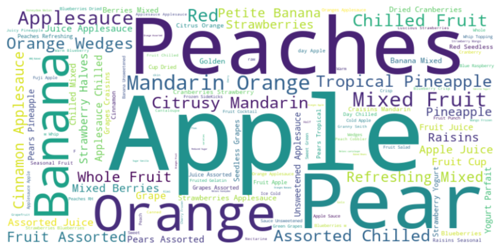
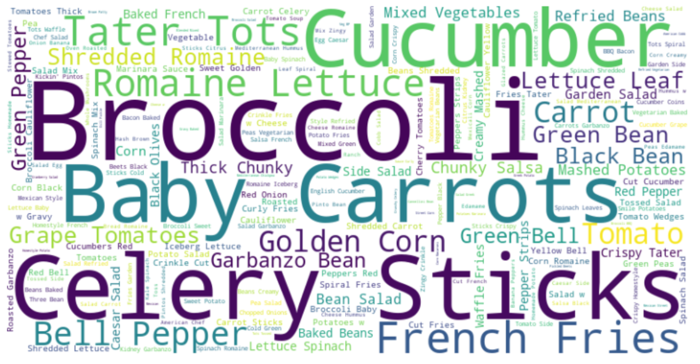
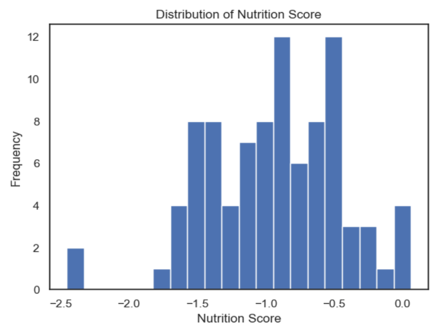
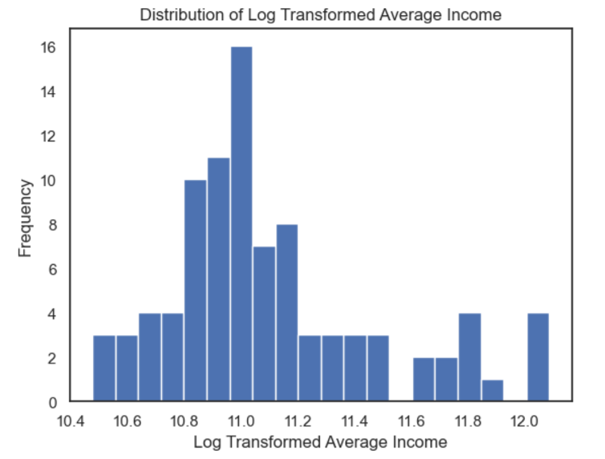
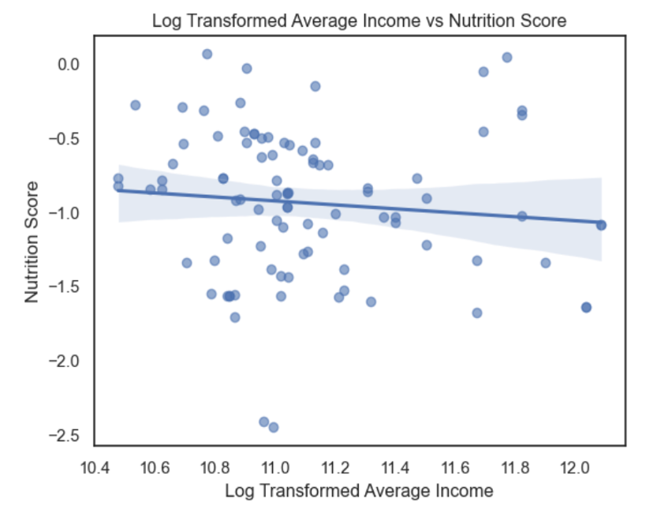
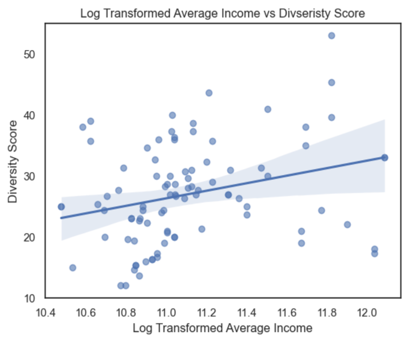
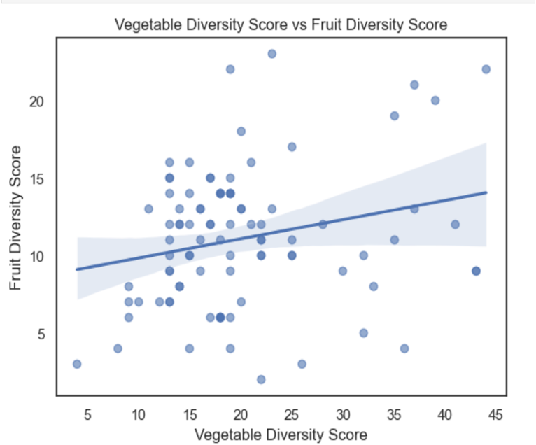
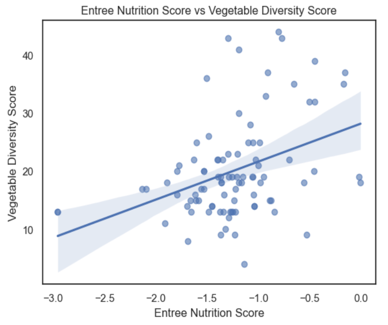

```{r setup, include=FALSE}
options(htmltools.dir.version = FALSE)
knitr::opts_chunk$set(
  echo = FALSE,
  message = FALSE,
  warning = FALSE
)
```

```{css, echo=FALSE}

.remark-slide-content {
  background-color: #CADCFC;
  font-family: 'Garamond', serif;
}

.remark-slide-content h1 {
  color: #FFFAFA;
  font-size: 3rem;
  padding: 1rem 1rem;
  margin: -1rem -4rem 1rem -4rem;  /* ← pulls edges out */
  background-color: #2F4F4F;
  border: 3px solid #8B4513;
}

/* This overrides the above just for the title slide */
.title-slide h1 {
  background-color: transparent;
  color: #2F4F4F;
  border: none;
  font-size: 3rem;
  margin: 0;
  padding: 0;
}


.remark-slide-content h2 {
  color: #8B4513;
  font-size: 1.7rem;
}

/* Title slide */
.title-slide {
  background-color: #CADCFC;
  color: #8B0000;
}
.title-slide h1 { color: black; border-bottom: none; font-size: 3rem; }
.title-slide h2 { color: #royalblue; font-size: 3.5rem; }
.title-slide.author { color: #8B0000; font-size: 1.1rem; }


/* Accent / highlight boxes */
.highlight-box {
  background-color: #FFF8DC;
  color: #2F4F4F;
  border-radius: 8px;
  font-size: 1.8rem;
  padding: 0.8rem 1.2rem;
  margin: 0.5rem 0;
}

.text-box {
  background-color: #DCDCDC;
  color: #000000;
  font-size: 1.6rem;
  border-radius: 8px;
  padding: 0.8rem 1.2rem;
  margin: 0.5rem 0;
}
.center-box {
  background-color: #FFF8DC;
  color: #2F4F4F;
  border-radius: 8px;
  padding: 0.8rem 1.2rem;
  margin: 0.5rem 0;
  font-size: 2rem;
  top: 70%;
  text-align: center;
}
.chalkboard {
  color: #FFFAFA;
  background-color: #2F4F4F;
  border: 3px solid #8B4513;
}
.footer {
  position: absolute;
  bottom: 1rem;
  left: 1rem;
  font-size: 1rem;
  font-family: "Google", sans-serif;
  color: #2F4F4F;
}
.remark-code {
  font-size: 0.8rem;  /* ← shrink this number to make it smaller */
}

/* Two-column layout helpers */
.left-col  { float: left;  width: 48%; }
.right-col { float: right; width: 48%; }
.clear     { clear: both; }


```


# Data Retrieval
.left-col[
.text-box[
__Process__
- Used selenium webdriver to search up school district on Nutrislice.
- Automated API link construction for each school
- Scraped the lunch menu of each school for the month of March
]
]
.right-col[


]

---

# Data Manipulation and Feature Engineering

.left-col[
.text-box[
- Created an average nutrition score for each school’s lunch menus for each school based on a NutriScore that subtracted positive marks for a food’s fiber and protein content from  negative marks for a food’s sugar and sodium content for example
- Created average diversity score within and among categories based on number of unique entriesfor each school
- Merged data with log transformed income data for based on school district

]
]

.right-col[


]

---
# Linear Regression 1: Income vs. Nutrition
.left-col[
.text-box[

- Lower nutrition score corresponds to better nutrition.
- The regression suggests a slight negative association which means that nutrition improves slightly as average income increases, however this relationship is not statistical significance (p = 0.34).
- Income explains about 1% of the variation in nutrition scores (R² = 0.01).
- 10% increase in income is associated with about a 0.013-point decrease in nutrition score.
]
]
.right-col[

]
---
# Linear Regression 2: Income vs. Diversity

.left-col[
.text-box[
- Higher diversity score corresponds to greater diversity.
- There is a weak positive relationship between district-level income and lunch diversity scores with statistical significance (p = 0.0061)
- Income only explains 8.1% of the variation in diversity (R² = 0.081). 
- These results suggest that while higher-income districts may offer slightly more
diverse menus, income alone is not a strong predictor of menu diversity.
- 10% increase in income (roughly $5,000–$10,000 depending on the district) is associated with about a 0.62-point increase in diversity score.
]
]
.right-col[

]

---
# Linear Regression 3: Vegetable Diversity vs. Fruit Diversity

.left-col[
.text-box[
- The regression suggests a slight positive correlation among fruit and vegetable diversity scores, and it is marginally statistically significant (p = 0.02).
- This shows that schools with more vegetable diversity generally have more fruit diversity.
- Vegetable diversity only explains about 5.7% of the variation in fruit diversity (R² = 0.057), so is not a strong predictor.
- There are a lot of outliers

]
]

.right-col[

]

---
# Linear Regression 4: Vegetable Nutrition Score vs. Fruit Nutrition Score

.left-col[
.text-box[
- The regression suggests a small positive correlation between entrée nutrition scores and vegetable diversity score, and it is statistically significant (p = 0.00017).
- This means that schools with less healthy entrée options generally have more vegetable diversity.
- One prediction for this is that schools with less healthy entrée options may also be categorizing french fries and high fat/sodium salads as vegetables.
- Entree nutrition scores only explains about 14% of the variation in vegetable diversity (R² = 0.14).
]
]
.right-col[

]

---
# Findings and Discussion


---
# Implications for Stakeholders

__Policy Makers__

- Provides evidence of income based nutrition disparities
- Can justify grant funding for low income districts
- Data driven findings can help allocate resources to districts with the greatest nutritional need

__School Administrators__

- More diverse menus could increase lunch participation and student wellbeing
- Low food variety may discourage students from eating school lunch entirely
- This project may discourage school administrators from using nutrislice if it exposes a failure to meet nutritional standards

__Public Health Officials__

- Poor nutrition in childhood is linked to lower academic performance and long term health outcomes
- Nutritional disparities in school lunches may reinforce existing socioeconomic inequalities

__Students and Families__

- Students dependent on school lunch are most vulnerable to poor nutrition and low food diversity
- Improved menu quality could directly impact short and long term health outcomes

---
# Ethical, Legal, and Societal Implications
__Ethical__

- Schools have a responsibility to provide nutritious options, particularly for students who rely on school lunch as their primary meal
- Poor nutritional offerings disproportionately impact low income students who have fewer alternatives
- Healthier menus are linked to better academic performance and long term health and well being

__Legal__

- Schools that fail to meet federal nutrition standards could face increased scrutiny or liability
- Districts with documented nutritional deficiencies may be subject to policy enforcement

__Societal__

- Nutritional disparities in school lunches risk widening existing socioeconomic inequalities
- Low income students who depend most on school lunch are most vulnerable to the consequences of poor menu quality
